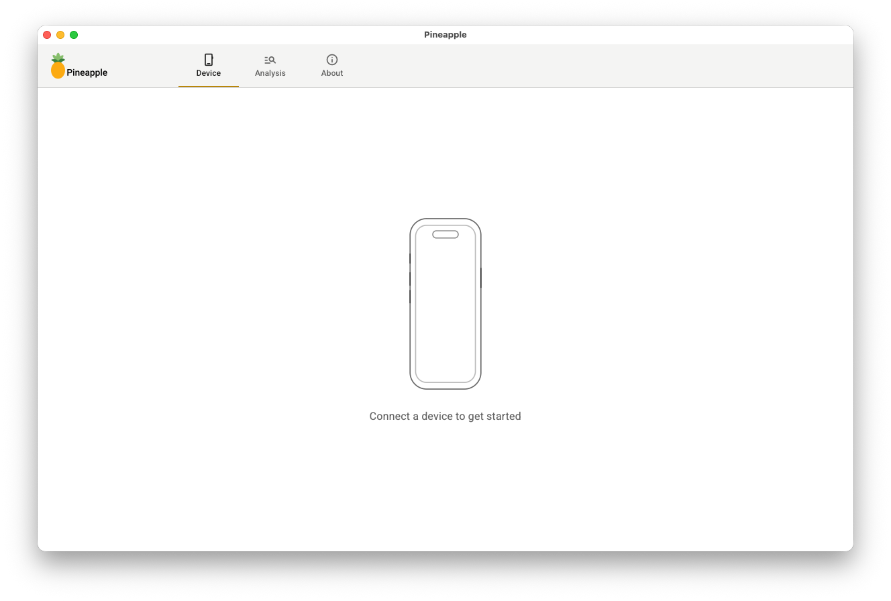
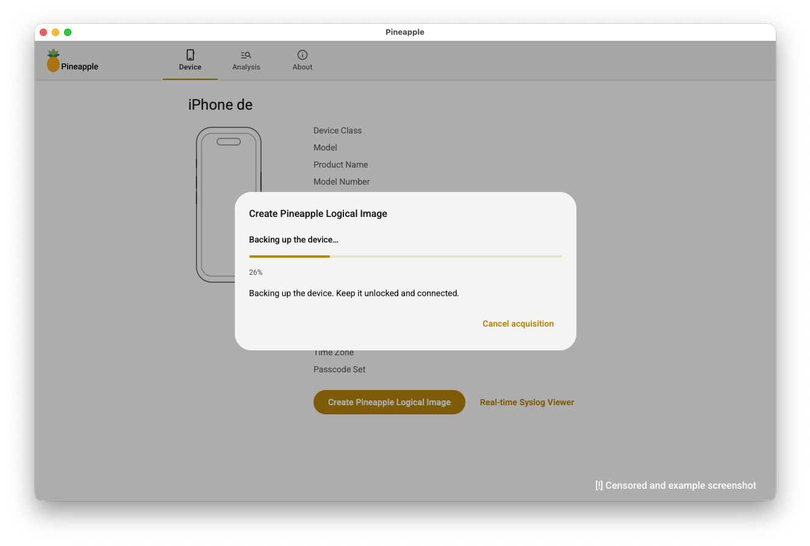
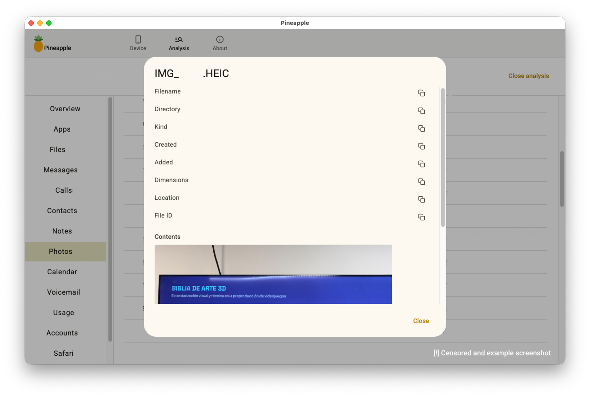

# Pineapple


An **iOS forensic analysis tool**: a desktop application that inspects an Apple
device over USB, captures a full logical image of it, and analyses that image
offline into a structured, queryable case.

Two principles shape every part of it:

1. **Read-only and non-destructive.** Pineapple never writes to the device,
   with one unavoidable exception — turning on backup encryption for an
   encrypted acquisition — which it always restores afterwards.
2. **Never guess.** When more than one device is attached, the tool refuses to
   act rather than pick one. Acting on the wrong device is worse than doing
   nothing.

---

## Disclaimer

Pineapple is intended for **authorized forensic examination, security research,
incident response, and education**.

- You are responsible for having the **legal authority** to access, image, and
  analyse any device and any backup you use with this tool. Laws on device
  access and on handling another person's data vary by jurisdiction — know the
  ones that apply to you.
- A logical image and the resulting case folder contain **highly personal data**
  (messages, photos, location and usage history, account metadata). Store,
  transfer, and dispose of them accordingly.
- The software is provided **"as is", without warranty of any kind**. The
  authors are not liable for any damage, data loss, or misuse.
- Pineapple is **not affiliated with, authorized, or endorsed by Apple Inc.**
  iOS, iPhone, iPad, and related marks are trademarks of Apple Inc.

## License

Pineapple is **open source**, released under the **MIT License** — see
[`LICENSE`](LICENSE).

---

## Screenshots



*The **Device** tab — usbmuxd-only presence detection; nothing is read until a
device is connected and trusted.*



*Capturing a logical image — a full MobileBackup2 backup packaged as one
`.pineapple` file, with per-phase progress. (Device identity fields blanked for
the screenshot.)*



*The **Analysis** case browser — a parsed case with the artifact nav-rail, and a
record detail view showing one photo's metadata plus an in-app preview.
(Example case; identifying data blanked.)*

---

## What it does

The app has three tabs, mirroring the workflow: **Device → Analysis**, with
**About** for credits.

### Device

- **Presence.** Detects a connected iPhone/iPad by talking only to the local
  `usbmuxd` daemon — no contact with the device itself, so it is safe to poll
  every couple of seconds.
- **Lockdown info.** Once you have tapped **"Trust this computer"** on the
  device, it opens a lockdown connection and shows a fixed set of identity
  fields (model, iOS version, serial, UDID, capacity, …). Unpaired or
  unreachable is reported as a distinct "needs trust" state and retried on every
  poll, so granting trust is picked up without replugging.
- **Live system log.** Streams `com.apple.os_trace_relay` into a bounded
  in-memory buffer the UI drains, with text/process filters, pause, clear, and
  export to a file.

### Logical acquisition

- A full **MobileBackup2** backup is run into a temporary staging directory,
  then packed into the path you choose as a single **uncompressed** (`ZIP_STORED`)
  zip named `*.pineapple`. Uncompressed so a reader can `mmap`/seek into a
  multi-GB image and so packaging stays fast. The internal layout is exactly
  what a restore expects, rooted at the device UDID.
- **Encryption is a device setting**, not a per-backup flag. For an encrypted
  acquisition on a device that does not already encrypt its backups, Pineapple:
  1. enables backup encryption with a password you provide,
  2. runs the backup,
  3. **always** restores the original state afterwards — on success, failure,
     and cancellation alike (the restore is shielded so a cancel still runs it).
     If the restore itself fails, the run still completes but the final note
     warns that the device was left with encryption on.
- Progress is reported by phase (`preparing → backing_up → packaging →
  restoring_encryption → done` / `error` / `cancelled`) with a percentage fed by
  MobileBackup2's own callback. Cancelling, or any failure, **rolls back** the
  partial archive.

### Analysis

Analysis needs **no device** — it works entirely from a saved `.pineapple`
image.

- **Peek.** The three root property lists (`Info` / `Manifest` / `Status`) are
  never encrypted, so device facts and the "is this image encrypted?" answer are
  read straight out of the zip before anything is unpacked.
- **Decrypt only what is needed.** For an encrypted image, Pineapple wraps
  [`iphone_backup_decrypt`](https://github.com/jsharkey13/iphone_backup_decrypt):
  the backup password unwraps the keybag, and only `Manifest.db` plus the source
  databases the parsers actually need are decrypted (into `<case>/decrypted/`).
  A wrong password fails cleanly. The key is held **only in RAM**, never written
  to disk.
- **Index, then parse.** The pipeline runs as phases on a background thread that
  checks for cancellation between each: `extracting → opening → indexing →
  parsing → writing_descriptor → done`. Indexing reads straight from
  `Manifest.db` (installed apps, every backed-up file with its size / timestamps
  / mode / symlink target). Parsing then walks a fixed list of artifact parsers
  (below), each tolerant of a missing or damaged source database — it is
  recorded as *skipped*, never fatal.
- **The case folder.** Everything a case needs lives in one folder you pick:

  ```
  <case>/<title>.json     the descriptor — source of truth for reopening
  <case>/analysis.db      the parsed results (SQLite, schema v4)
  <case>/backup/<udid>/   the archive extracted as-is (encrypted blobs stay encrypted)
  <case>/decrypted/       Manifest.db + the source DBs the parsers needed
  ```

  `<title>` defaults to the device serial; there is exactly one analysis per
  folder. `analysis.db` carries a schema version — opening a case built by an
  older version is refused (re-analyse it).
- **Browse.** A case browser with a nav-rail over **Overview, Apps, Files,
  Messages, Calls, Contacts, Notes, Photos, Calendar, Voicemail, Usage,
  Accounts, Safari, WhatsApp**. Every list is a paginated, searchable table;
  any row opens a full-record detail view with a per-field copy button.
- **Files.** The file index is browsable with a domain filter. Any file can be
  previewed in place (size-capped at 5 MB, classified as image / plist / text /
  binary / unavailable) or extracted to disk. For an encrypted case this needs
  the backup password — entered up front or via an unlock banner in the browser.

---

## How the analysis works, in detail

### The `.pineapple` archive

A plain uncompressed zip whose entries are rooted at the device UDID:

```
<udid>/Info.plist
<udid>/Manifest.plist
<udid>/Manifest.db
<udid>/Status.plist
<udid>/aa/aa11bb22…        ← backup file blobs, named by SHA-1(domain-relativePath)
<udid>/ab/…
```

`Manifest.db` maps every backed-up file to its blob and stores an
`NSKeyedArchiver` metadata blob per file; the indexer decodes each one for
size, timestamps, POSIX mode, and symlink target. In an encrypted image, every
blob **and `Manifest.db` itself** is AES-encrypted with per-file keys wrapped in
the keybag from `Manifest.plist`.

### Artifact parsers

Each parser declares where its source database lives (domain + relative path)
and how to read it. The source DB is extracted (with its `-wal` / `-shm`
sidecars, so recently written rows are visible), opened read-only, and its rows
written into `analysis.db`.

| Parser | Source database | What it yields |
| --- | --- | --- |
| `messages` | `HomeDomain/Library/SMS/sms.db` | SMS/iMessage; iOS 16+ recovers body text from `attributedBody` (see below) |
| `calls` | `…/CallHistoryDB/CallHistory.storedata` | call history (Core Data). **Encrypted backups only** |
| `contacts` | `…/AddressBook/AddressBook.sqlitedb` | names plus `ABMultiValue` phones/emails |
| `notes` | `AppDomainGroup-group.com.apple.notes/NoteStore.sqlite` | note titles + body text (gzip+protobuf, best-effort) |
| `photos` | `CameraRollDomain/Media/PhotoData/Photos.sqlite` | asset rows + albums (Core Data); each row keeps the real Manifest file id so the browser can preview the image |
| `calendar` | `…/Library/Calendar/Calendar.sqlitedb` | events, calendars, locations, invitees (schema is introspected — it drifts between iOS releases) |
| `voicemail` | `…/Library/Voicemail/voicemail.db` | caller, duration, trashed date, transcription when present |
| `accounts` | `…/Library/Accounts/Accounts3.sqlite` | configured accounts (mail / social / iCloud …), **metadata only, no credentials** |
| `device_usage` | `AppDomainGroup-group.com.apple.coreduet/…/knowledgeC.db` | a curated four-stream slice of CoreDuet, capped at 50k rows. **Encrypted backups only** |
| `safari_history` | `…/Safari/History.db` | visited URLs + visit times. **Encrypted backups only** |
| `safari_bookmarks` | `…/Safari/Bookmarks.db` | bookmark tree |
| `whatsapp` | `AppDomainGroup-group.net.whatsapp.WhatsApp.shared/ChatStorage.sqlite` | chats + messages |

**"Encrypted backups only"** — iOS deliberately withholds call history, Safari
history, and `knowledgeC.db` from *unencrypted* backups, so their absence there
is expected and the skip note says so. This is the main practical reason to
capture an encrypted image.

### Decoding what Apple stores

- **iMessage `attributedBody`.** Since iOS 16 the `text` column is often NULL
  and the message body lives in an `attributedBody` blob — an
  `NSMutableAttributedString` serialised in Apple's legacy *typedstream* format
  (not a keyed archive). Pineapple decodes it with
  [`python-typedstream`](https://github.com/dgelessus/python-typedstream) and
  pulls the first string out. Best-effort; falls back to `None`.
- **Apple Notes body.** `ZICNOTEDATA.ZDATA` is a gzip-compressed protobuf. A
  small hand-rolled varint reader walks the length-delimited fields to the plain
  text (`Document → Note → note_text`); `ZSNIPPET` is the fallback.
- **Timestamps.** Cocoa "absolute time" is seconds since 2001-01-01 UTC, but
  some iOS 11+ columns use nanoseconds — a magnitude check picks the scale, and
  Unix-epoch columns are handled separately. **Every timestamp in `analysis.db`
  is an ISO-8601 UTC string**, so the frontend never does timezone maths.
- **Core Data.** Several sources (`calls`, `notes`, `whatsapp`, `photos`,
  `calendar`, `accounts`, `device_usage`) are Core Data stores with `Z`-prefixed
  tables and `Z_PK` keys.
- **Photo file ids.** `Photos.sqlite` names each asset by directory + filename,
  not by backup id. The parser resolves the real Manifest file id from the
  already-indexed file table, leaving it NULL when the asset's data is not in
  the backup (an iCloud-only photo). That id is what preview / extract then use.

### Error model

- **`AnalysisError`** — a problem you can act on (malformed archive, wrong
  password, missing manifest, schema mismatch). Raised instead of leaking
  library-specific exceptions.
- **`ArtifactUnreadable`** — one source database could not be parsed; the run
  records it as skipped and carries on.

---

## Architecture at a glance

Pineapple is a **single OS process**: a [pywebview](https://pywebview.flowrl.com/)
native window hosting the Angular UI, which calls Python over the
`window.pywebview.api` bridge.

- **The bridge is synchronous; the device layer is async.** `pymobiledevice3`
  v11 is async-only. Short calls (list devices, read info) spin up a throwaway
  event loop; long-lived work (syslog, backup, analysis) runs on **one shared
  event loop** owned by `DeviceSession` on a daemon thread, because each
  streaming feature holds a device connection and the device tolerates only so
  much concurrency.
- **The long-lived-job pattern.** `SyslogStream`, `DeviceBackup`, and
  `AnalysisRun` share a shape (not a base class): a progress dataclass the
  frontend polls, an op-lock serialising start/stop/cancel, a state-lock
  guarding the progress snapshot, **cooperative cancellation** via a
  `threading.Event` checked between phases, a teardown with a timeout so a slow
  cleanup never hangs the UI, and **rollback** of partial output on cancel or
  failure.
- **The frontend** is Angular 22, zoneless, fully signal-based. Four polling
  services (`Device`, `Syslog`, `Backup`, `Analysis`) each keep a state signal
  and a poll loop, and become an **idle no-op when `window.pywebview` is
  absent** — so the UI also runs in a plain browser during development.

For the full "why of everything" — the process model, response envelopes,
`DeviceSession`, the backup's per-operation service contexts, the analysis
pipeline internals, the case-folder read model, and the frontend component
patterns — see **[`ARCHITECTURE.md`](ARCHITECTURE.md)**.

---

## Project layout

| Path | Purpose |
| --- | --- |
| `backend/` | Python `>=3.14` ([`uv`](https://docs.astral.sh/uv/) + `uv_build`). Device access, acquisition, analysis, the pywebview host, and the bridge. |
| `backend/src/pineapple/devices.py` | Async USB device access. |
| `backend/src/pineapple/session.py` | `DeviceSession`: the one shared asyncio loop for long-lived work. |
| `backend/src/pineapple/syslog.py` | `SyslogStream`: the live system-log stream. |
| `backend/src/pineapple/backup.py` | `DeviceBackup`: the MobileBackup2 acquisition + `.pineapple` packaging. |
| `backend/src/pineapple/analysis/` | Offline `.pineapple` parsing: archive, reader (plain / encrypted), the indexer, `parsers/`, the run pipeline, and the case folder. |
| `backend/src/pineapple/api.py` | `Api`: the synchronous bridge bound to `window.pywebview.api`. |
| `backend/src/pineapple/app.py` | The pywebview host window (`pineapple-gui`). |
| `backend/tests/` | `pytest`; no hardware — the `pymobiledevice3` / `webview` / `iphone_backup_decrypt` boundaries are faked. |
| `frontend/` | Angular + Angular Material, **`pnpm` only**. Rendered inside the pywebview window. |
| `frontend/src/app/` | The shell + the `device` / `syslog` / `backup` / `analysis` / `about` / `brand` feature areas. |
| `ARCHITECTURE.md` | The deep reference: execution model, data formats, per-library usage. |
| `UI.md` | The UI design system and component patterns. |
| `AGENTS.md` | Instruction file for AI coding agents: orientation plus a map of every doc. |
| `CLAUDE.md` | Instruction file for AI coding agents (Claude Code): the repository conventions and hard rules. Useful to human contributors too. |

---

## Requirements

- **Python `>=3.14`** and [`uv`](https://docs.astral.sh/uv/)
- **Node.js** and [`pnpm`](https://pnpm.io/)
- A desktop OS with a system webview (macOS, Windows, or Linux with a WebKitGTK
  runtime — see the [pywebview docs](https://pywebview.flowrl.com/))
- For the **Device** and **acquisition** features: a USB-connected, paired iOS
  device. **Analysis** needs only a saved `.pineapple` file.

## Setup

```bash
cd backend  && uv sync
cd frontend && pnpm install
```

## Run

```bash
# Build the UI once, then open the desktop window (serves the production build)
cd frontend && pnpm run build
cd backend  && uv run pineapple-gui
```

## Development loop

```bash
cd frontend && pnpm start                  # terminal 1: ng serve on :4200
cd backend  && uv run pineapple-gui --dev   # terminal 2: window against the dev server
```

## Checks

```bash
cd backend  && uv run ruff check . && uv run ruff format --check . && uv run mypy && uv run pytest
cd frontend && pnpm lint && pnpm exec prettier --check "src/**/*.{ts,html,scss}" && pnpm test && pnpm build
```

## Testing

Neither suite touches hardware.

- **Backend** (`uv run pytest`): `tests/support.py` fakes the `pymobiledevice3`
  and `webview` boundary; `tests/analysis_support.py` builds a **tiny real
  on-disk MobileBackup2 backup** (real SQLite source DBs, a real `attributedBody`
  sample, a real Notes protobuf) and a `.pineapple` from it, and fakes
  `iphone_backup_decrypt`. The long-lived jobs are driven by polling their
  progress to a terminal phase.
- **Frontend** (`pnpm test`, vitest): services are tested against a partial
  bridge installed on `window.pywebview`; components with `TestBed` and a faked
  service.

CI (`.github/workflows/ci.yml`) runs ruff / mypy-strict / pytest and
prettier / eslint / vitest / build on every push and PR.

---

## Built on

Pineapple does the orchestration; the hard forensic work is done by:

- **[pymobiledevice3](https://github.com/doronz88/pymobiledevice3)** — talks to
  the iPhone over USB: lockdown, the MobileBackup2 acquisition, the live syslog.
- **[iphone_backup_decrypt](https://github.com/jsharkey13/iphone_backup_decrypt)**
  — unlocks and decrypts encrypted iOS backups.
- **[python-typedstream](https://github.com/dgelessus/python-typedstream)** —
  decodes the typedstream `attributedBody` blobs holding iOS 16+ iMessage text.
- **[pywebview](https://pywebview.flowrl.com/)** — hosts the native desktop
  window.

---

## Contributing

- Work happens on the **`development`** branch; **`main`** holds the baseline.
- `ruff`, `mypy --strict`, `pytest`, and the frontend `lint` / `prettier` /
  `test` / `build` must stay green — CI enforces it.
- Conventions and the incremental-change philosophy are in
  [`CLAUDE.md`](CLAUDE.md). Both [`CLAUDE.md`](CLAUDE.md) and
  [`AGENTS.md`](AGENTS.md) are instruction files for AI coding agents — start
  from [`AGENTS.md`](AGENTS.md).
